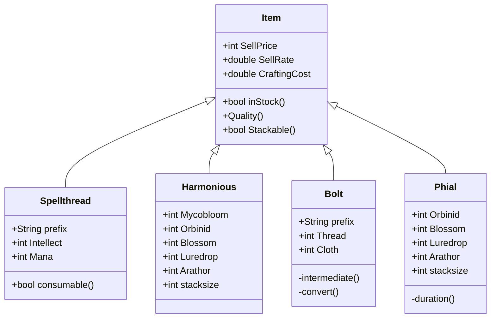

# UNIVERSIDAD NACIONAL DE COLOMBIA
# PROGRAMACIÓN ORIENTADA A OBJETOS

# Santiago Daza Yepes

## Reto 2: Diagramas UML

### Elija un problema de la vida real (sistema de gestión de biblioteca, negocio de compra-venta, automóvil, etc) que se pueda modelar a través de objetos y clases. Plantee las relaciones de clases, composiciones, propiedades y comportamientos del sistema en uno mas diagramas tipo UML.

El diagrama describe una clase de items comerciables dentro del juego "World of Warcraft" incluyendo su precio de venta, costo de producción y tasa de ventas.
+ Para cada objeto específico se determinan la cantidad de componentes requeridos para su fabricación.
+ Igualmente se mencionan métodos únicos para cada objeto dependiendo de su función dentro del juego (material intermedio, duración, valor de conversión)

